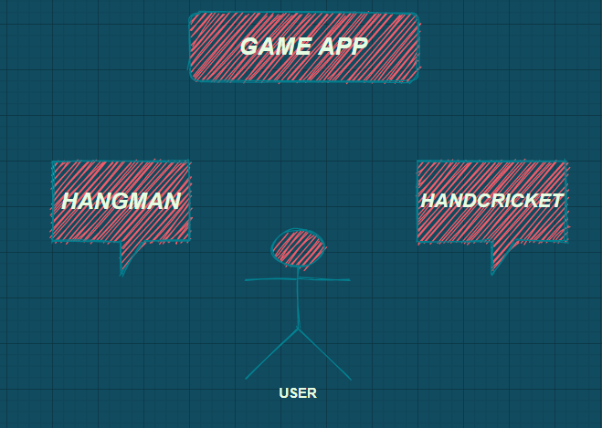
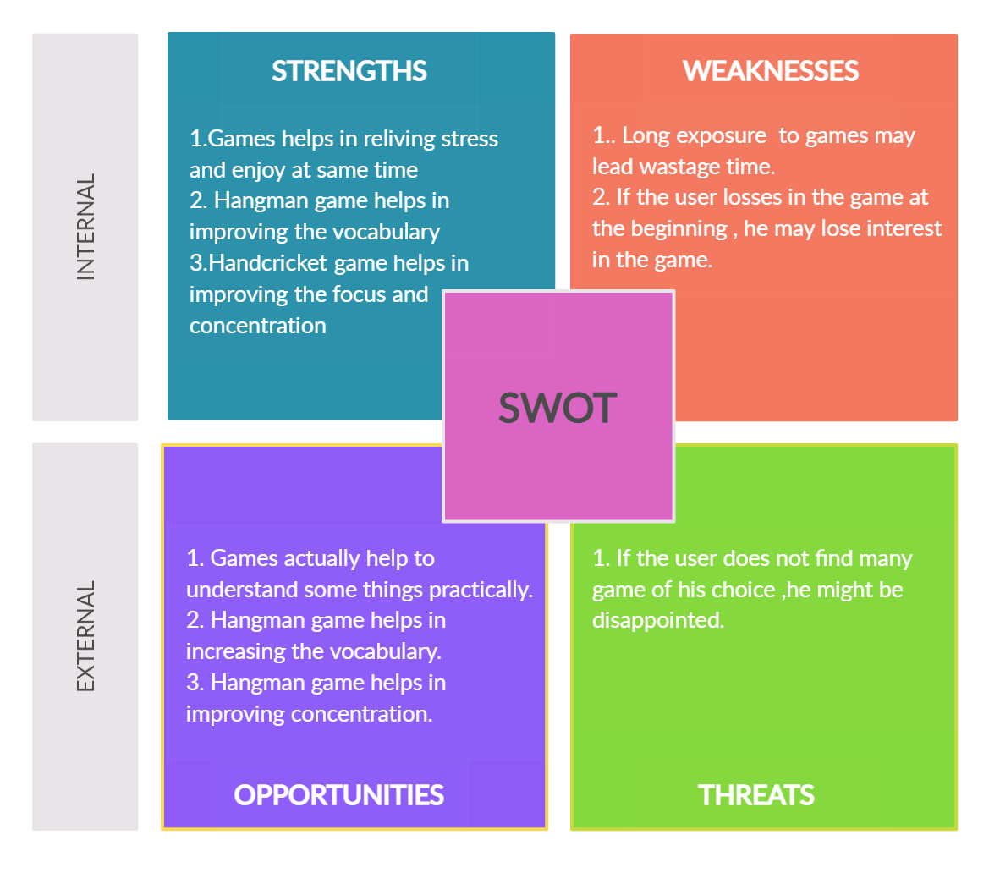

# Requirements
## Introduction
----
Playing game as an application have become modern trend in  this era from children to old age people. It has attracted a lot of attention and has gained a lot of popularity in recent days.
This is a gaming application which allows the user to select between the games and play accordingly. This application includes hangman game and handcricket game as of now. 

## Research
----

The growth of modern devices like phones,tablets,laptop have increased the demand for gaming application. Even before the pandemic, gaming was a global phenomenon. As smartphones proliferated, so did access to gaming. As lockdowns set in, worldwide game app downloads increased 30% in the first few months and is increasing exponentially.

## Cost and Features
----
### Cost:

### Features:
Features of this game include, it gives an option to the user select between games and have fun.The user can select either hangman or handcricket game. Hangman is a multiuser game where nonplayer decides the word and the players guess it within the limited number of trials. Handcricket is singleuser game where the user can play with computer.

## Defining Our System
----
 
 
 The system consists of two games, hangman and handcricket. The user can enter his choice of his game and play accordingly.

### Hangman:
Hangman is an old school favorite, a word game where the goal is simply to find the missing word or words. It is a game of two or more players. Where one player gives the word. And the other tries to think of the word.

### Handcricket
Handcricket is an effort to help you recall your childhood version of Cricket, which you used to play with hands. This is a game which can be played with hands, in which fingers are used to draw a score. If both players draw the same number, batsman is declared to be OUT. Otherwise, the score of batsmen is added to the count. 

## SWOT ANALYSIS
----

# 4W&#39;s and 1&#39;H
----
### Who:
Users of almost all age group can use this.

### What:
It is a gaming application, where the users can select the game of their choice and play. As of now it has only handcricket and hangman games.

### When:
Anytime the user can play and refresh his mind.

### Where:
It can played by the young kids in thier playing hours to the people of all age groups to take break from the highly packed schedule and enjoy.

### How:
The system gives the user to choose the game which he wants to play.
If the user selects Hangman:

1. System asks for the user to enter the  number of players and   their respective user name.
2. It asks the number of rounds they are willing to play.
3. Then the system asks the non player member to enter an word to guess to the other fellow members.
4. The non-player gusses the word and this guessing continues for few trials and if he guesses correctly within the limited trials and in majority of rounds he wins or losses the game.

If the user selects Handcricket:

1. System asks for the username and the number of over.
2. System gives the user the choose between batting and bowling.
   1. If you choose to bat
   System asks us to select a number between 1 to 6 and if the selected number matches with the number that is randomly generated then you would be declared as out and if not the number you chose will be added to your score.
   2. If you choose to ball 
   The process will be similar to that of batting but here the player will be the computer.

# Detail requirements
----
## High Level Requirements:
|ID| Description   | Category   |Status|
|----|----|----|----|
|   HRO1 |  System shall allow user to select between two games   | Technical   |TBD-S1|
|   HRO2 |  More than two games can be implemented  | Technical   |Future|
|   HRO3 |  If user selects 1 , he can play Hangman game|Technical  |TBD-S1|
|   HRO4 |   If user selects 2 , he can play Handcricket game| Technical   |TBD-S1|

##  Low level Requirements:

 ID | Description | HLR ID| Status (Implemented/Future)|
 |----|----|----|----|
|LRO1 |  When user opens this application, he can acces two games ,1 for hangman game and 2 for handcricket.If he selects other than this the application shall exit  | HRO1  |TBD-S1|
|   LRO2 |  More than two games can be implemented ,in the future | HRO2  |Future|
|   LRO3 |  If user selects 1 , It takes him to the hangman game , where user is asked to enter username and other information . It is a multiuser game , where one user enters the word and the other is asked to guess and viceversa. Based upon there scores in each round winner is decided|HRO3 |TBD-S1|
|  LRO4|   If user selects 2 , he can play Handcricket game, Where user is asked to enter his information. It is single person game , where user playes with the computer.He is given choice between batting and bowling. In batting user is allowed to bat and his score is calculated. In bowling computer score is calculated and if the user input the rndom number generated by the computer is same then it is an out.|HRO4  |TBD-S1|
