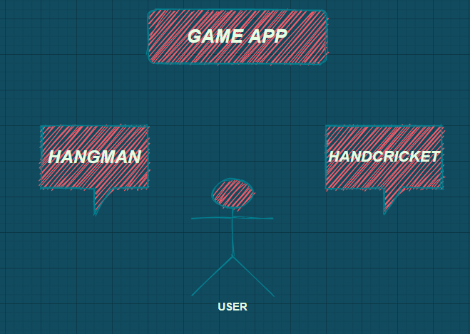

# Requirements
## Introduction
Playing game as an application have become modern trend in  this era from children to old age people. It has attracted a lot of attention and has gained a lot of popularity in recent days.
This is a gaming application which allows the user to select between the games and play accordingly. This application includes hangman game and handcricket game as of now. 

## Research

The growth of modern devices like phones,tablets,laptop have increased the demand for gaming application. Even before the pandemic, gaming was a global phenomenon. As smartphones proliferated, so did access to gaming. As lockdowns set in, worldwide game app downloads increased 30% in the first few months and is increasing exponentially.

## Cost and Features
#### Cost

#### Features
Features of this game include, it gives an option to the user select between games and have fun.The user can select either hangman or handcricket game. Hangman is a multiuser game where nonplayer decides the word and the players guess it within the limited number of trials. Handcricket is singleuser game where the user can play with computer.

## Defining Our System
 
 
 The system consists of two games, hangman and handcricket. The user can enter his choice of his game and play accordingly.
## SWOT ANALYSIS

# 4W&#39;s and 1&#39;H

## Who:

**TBD**

## What:

**TBD**

## When:

**TBD**

## Where:

**TBD**

## How:

**TBD**

# Detail requirements
## High Level Requirements:
--- TBD in Tabular Format 
-- ID | Description | Status (Implemented/Future)

##  Low level Requirements:
--- TBD in Tabular Format 
-- ID | Description | Status (Implemented/Future)